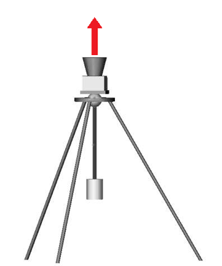

# Compass Star Tracker

- The application was made as a computer engineering graduation project.
- This project estimates the local coordinates of the Smart Phone on the Earth

## Estimate Local Cordinates
For cordinate estimation two information needed. One is night sky image.  The night sky image should be taken while the camera optical axis aligned with the local direction of the gravity. Following image illustrate how to photo taken:

Second information needed for cordinate estimation is the time image was taken. Using theese two information application estimates local cordinates in tems of lattitude and longitude.

## Project Structure
- The project has two part. One part is [MobileApp](MobileApp) the other one is [BackEnd](BackEnd)
- Each part has own README.md file.
- The mobile application part is an mobile application.
- With mobile application user takes a photo. And application sends taken photo to BacEnd application.
- BackEnd application estimate cordinate from sended image. And response coordinade to the mobile application.
- The mobile application shows coordinates on maps in the application.

## Demo
[YouTube Demo Video]( https://www.youtube.com/watch?v=SVofps3m79Y )